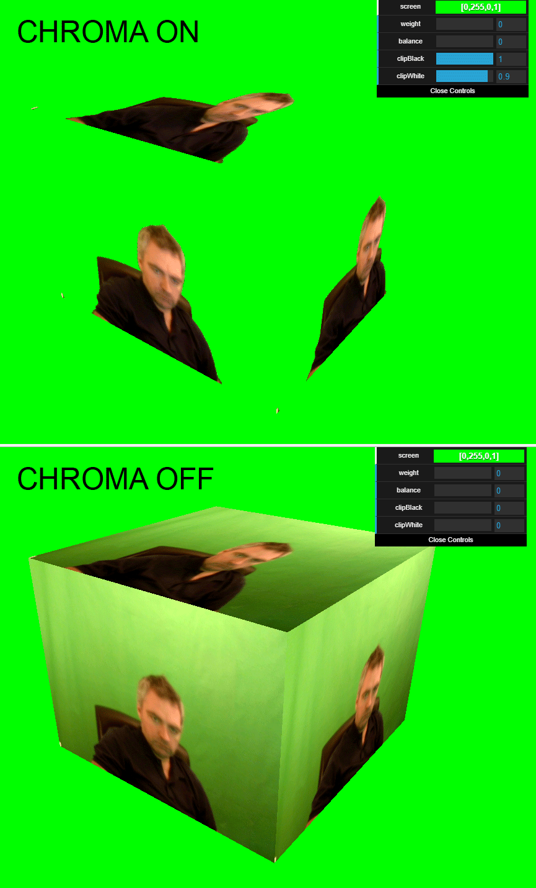
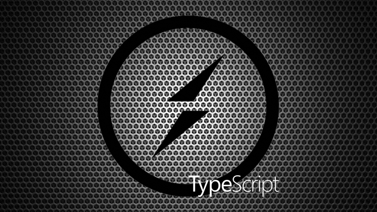

# Webcam as Texture using Three.js 
 
> To help support this TypeScript boilerplate, please take a moment to look at my official TypeScript courses in    
 [Three.js and TypeScript](https://www.udemy.com/course/threejs-tutorials/?referralCode=4C7E1DE91C3E42F69D0F) and    
 [Socket.IO and TypeScript](https://www.udemy.com/course/typescript-socketio/?referralCode=2F6E227AC7EB9D147327)

This html creates a 3d cube in three.js and uses the webcam video as the texture.
*I only made it work in chrome at the moment, and you need your webcam plugged in so it can connect.*

## Working demo of this page
https://sean-bradley.github.io/Webcam-as-Texture-using-Three.js/

## Video Tutorial on how to use this page with OBS
https://www.youtube.com/watch?v=SdYf4OvnVxY

## -- Update --
Added chroma option from the seriously.js library so chroma keying can also be applied at the webcam capture level.

*Settings shown work best for my situation. You will need to adjust for your own environment.*

# TypeScript Courses

If you got this far, you probably like TypeScript just like I do,
I have created two TypeScript courses specializing in the [Three.js](https://www.udemy.com/course/threejs-tutorials/?referralCode=4C7E1DE91C3E42F69D0F) and [Socket.IO](https://www.udemy.com/course/typescript-socketio/?referralCode=2F6E227AC7EB9D147327)
 libraries that you may find useful.

## Threejs and TypeScript Course

## Socket.io and TypeScript Course

